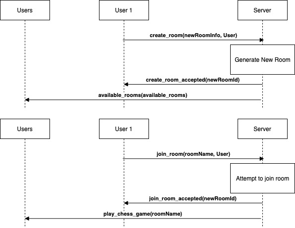
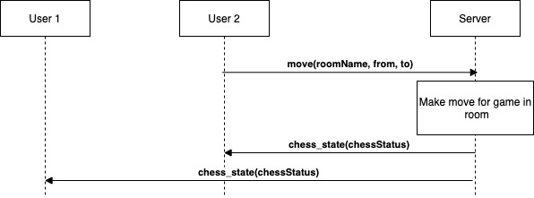
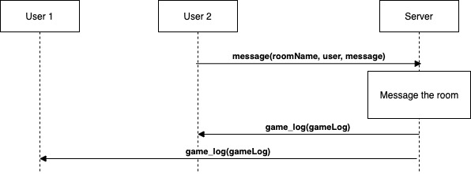

# Online Chess JS
online chessJS client over at https://github.com/WDDnguyen/chessjs_client.

This chess Node server server provides user functionality to play a chess match by joining chess rooms through socket.io.

### Creating new room
When user creates a room, Node server generates a new room with a unique roomId, game log and chess game. After creating the new room, all other users connected to the Node server are notified about the new create.

### Playing chess
Server sends chess status to all users in the room.
The chess status contains all information such as
- fen
- current player
- winner
- history
- potential moves
- checked
- game over

After two players join a room, game is started and white player starts.
When a player makes a move, user emits 'move' with the move information to the server. Server receives the move information and attempts to make the move on the chess engine. If move is valid, the chess status is updated and send to all users connected to the room.

### Messaging

When a player messages in the chat box, the user emits 'message' to the server. If it's an available message, the server append the message to the game log and send to all users connected to the room.

